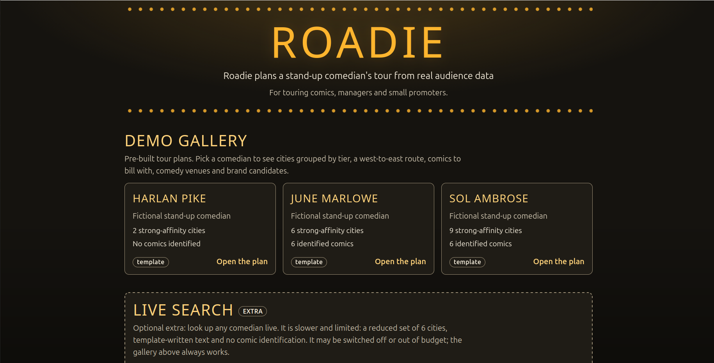
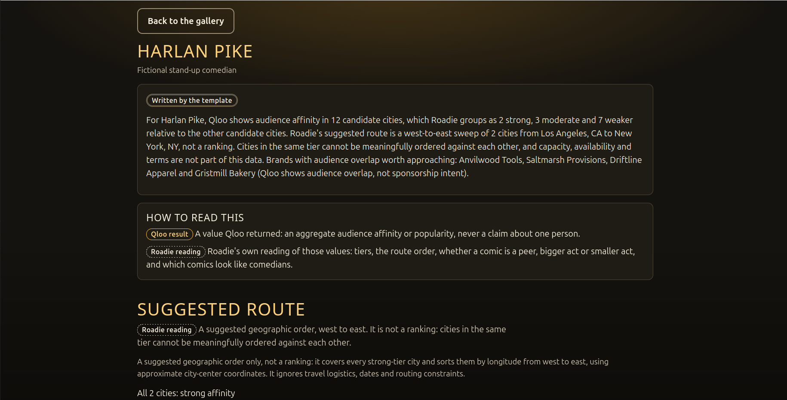
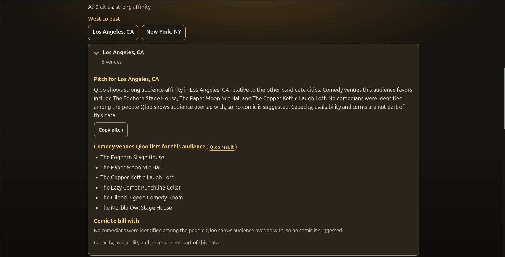

# Roadie

An AI tour planner for touring stand-up comedians: give it a comedian's name and it returns a plan grounded in Qloo's audience data, with cities, a route, venues, comics to bill with and brands. Built for the Qloo Agentic Hackathon.

**Live demo:** https://roadie-tour-planner.onrender.com

The hosted demo has five pre-built plans and a working live search. The live search is an optional extra that ends on Nov 16, when the hackathon key is deactivated; the pre-built plans keep working. After the server starts or wakes there is a one-time warm-up of one to two minutes before live search answers. Live plans do not run the comedian check, so they suggest no comic. See [docs/DEPLOY.md](docs/DEPLOY.md#known-limits) for the measurements.

## Screenshots
These screenshots use invented synthetic data; the hosted demo shows the pre-built plans, which are based on real Qloo data.






## What it does
For one comedian, Roadie produces a plan with these parts:
- **Cities in affinity tiers** (strong, moderate, weaker), not a 1-to-N ranking.
- **A west-to-east route** through the strongest cities.
- **Comedy venues** that each city's audience favors, with a note when Qloo returned few.
- **Comics to bill with**: people with overlapping audiences, marked peer, bigger act or smaller act.
- **Brands with audience overlap** worth approaching.
- **A copyable booking pitch** per city and one overall.

Every line is labeled as a Qloo result or as Roadie's own interpretation, and weak evidence is flagged instead of hidden.

## Why it needs Qloo
Every signal in a plan comes from Qloo's Insights API, called through the official Qloo harness: audience affinity for named cities, similar people, comedy venues in each city and brands with audience overlap. Roadie adds only the tiers, the route order and the wording. Without Qloo it has no cities to score, no comics to suggest and no venues to list, so the app would have nothing to say. The language model never supplies facts; it only words what the plan already contains.

## What we learned from the data
- **City affinity scores cluster tightly.** For the real comedians we tried, most candidate cities landed within a few hundredths of each other, so Roadie groups cities into tiers and does not present a firm order.
- **Shared-audience scores and trends were flat or tiered for comedians**, so those sections were cut rather than shown with weak numbers.
- **Qloo's similar-people list is not all comedians.** Each person is marked identified or not from their one-line description with a simple text match. It can miss real comics, so the page says how it decided.

## Responsible by design
- Affinity describes aggregate audiences, never individuals or causes. Roadie says "high audience affinity in X", never "fans in X will buy".
- Capacity, booking terms and sponsorship intent are not in the data, and the page says so.
- Model text is verified against the plan (names, comics, brands, figures, audience-identity words, intent claims) and falls back to a template when it fails. The gallery and live plans work with no model at all.
- Person tags (which can name sensitive traits) are never kept.
- Only public comedian and city names go to Qloo. Ambiguous names are put to the user, never guessed.

## Run it
Needs Python 3.11+. This runs on the invented sample comedians in `tests/synthetic/`; no key, network or Qloo account is needed.
```
cd backend && pip install -e '.[dev]'
cd .. && ROADIE_DATA_DIR=/tmp/roadie-demo python scripts/build_gallery.py --fixtures tests/synthetic --template
cd backend && ROADIE_DATA_DIR=/tmp/roadie-demo python -m uvicorn roadie.api:app --port 8000
# open http://127.0.0.1:8000/
```
Tests (synthetic data only, no network):
```
cd backend && python -m pytest
```
Live search is off by default and is on only with `ROADIE_LIVE=1` and the `qloo` CLI set up with a key; the hosted demo runs with it on ([docs/DEPLOY.md](docs/DEPLOY.md#known-limits)). It uses one long-running `qloo mcp` process by default (`ROADIE_QLOO_MODE=persistent`; `oneshot` is the old one-call-per-process behavior), so for the first one to two minutes after start-up it answers "warming up". Person search by name still uses a one-off call. See [docs/API.md](docs/API.md). To deploy as a Docker image, see [docs/DEPLOY.md](docs/DEPLOY.md).

## Data handling
Qloo's organizers do not allow Qloo response data in a public repository, so this repository contains code and synthetic test data only. Real responses and the gallery built from them live in a private folder (`ROADIE_DATA_DIR`) outside version control, and tests use invented comedians, venues, brands and ids. Details and the guard tests are in [docs/DATA.md](docs/DATA.md).

## Repository map
| Path | What is there |
|---|---|
| `backend/roadie/` | planning pipeline, ranking, narrator, Qloo client, API |
| `backend/tests/` | test suite (synthetic data only) |
| `frontend/index.html` | the whole UI: one static file, no build |
| `scripts/` | gallery builder, capture tool (owner only), container entrypoint |
| `tests/synthetic/` | three invented comedians in the real fixture layout |
| `docs/` | [ARCHITECTURE](docs/ARCHITECTURE.md), [API](docs/API.md), [DATA](docs/DATA.md), [DEPLOY](docs/DEPLOY.md), [fixture notes](docs/fixture-notes.md) |
| `Dockerfile`, `render.yaml` | free Docker web service deployment |

## License
MIT, see [LICENSE](LICENSE).
